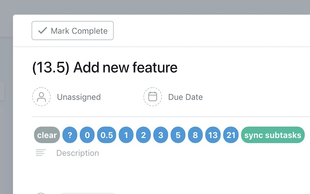
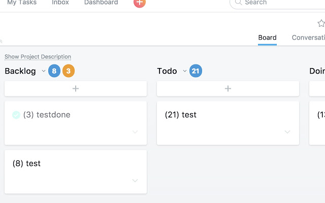
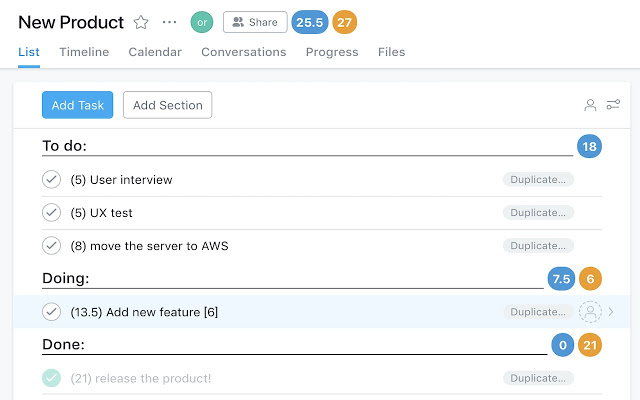

# Chrome Extension app: [StoryPoint for Asana](https://chrome.google.com/webstore/detail/storypoint-for-asana/ipkcinfcdhhcmibffhlklololceffgnc)

This app tracks scrum story points super-easily on Asana boards.

# Features

- you can track story points
- you can check both "NotCompleted points" and "Completed points" summed up automatically in each column
- you can check both "NotCompleted points" and "Completed points" story points summed up automatically in a project
- you can sum up subtask story points in a task

# Supported Layouts

### Board Layout

### List Layout

# Known Issues

- Asana Board: tasks on each lists are lazy-loaded. so if you have more than almost 25 tasks in a list, summed up points may be wrong or under-calculated. so if you calculate total points correctly, just scroll each list!

# Todos

- [ ] dynamic story point range